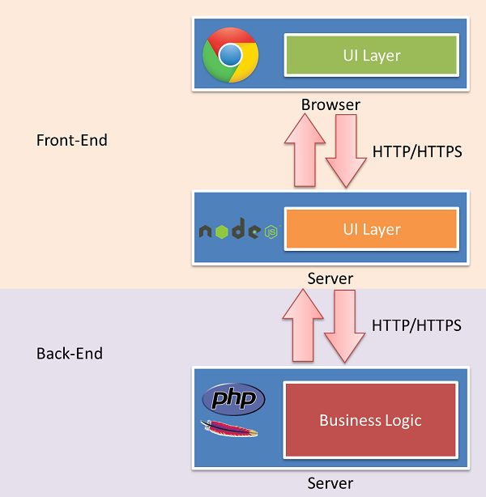

---

layout: varya

style: |

    #Launch h2 {
        margin:250px 0 0;
        color:#000000;
        text-align:center;
        font-size:100px;
        outline:none;
        text-shadow: 5px 0 15px #FEF1B5;

        }
    #Launch p {
        margin:10px 0 0;
        text-align:center;
        color:#000;
        font-style:italic;
        font-size:20px;
        }
        #Launch p a {
            color:#000;
            }

    #me .note,
    #me code {
        font-size: 75%;
    }

    #debian {
        background-image:url("pictures/package.jpg");
        background-repeat: no-repeat;
        background-position: right bottom;
    }

    #debian ul {
      font-size: 125%;
    }

    .terminal {
        background-color: #333;
        color: #FFF;
    }
    .terminal h2 {
        color: #CCC;
    }
    .terminal code {
        color: #FFF;
    }
    .terminal pre mark.comment {
        color: #FFF8DC;
    }

    .scheme {
        text-align: center;
    }
    .scheme > div {
        padding: 20px;
        margin: auto;
        bottom: 0;
    }
    .scheme h2 {
        display:none;
    }

    #Picture h2 {
        color:#FFF;
        }
    #SeeMore h2 {
        font-size:100px
        }
    #SeeMore img {
        width:0.72em;
        height:0.72em;
        }
---

# Deploy the Web {#Launch}

By [Varya Stepanova](http://varya.me/)

## Leuk u te ontmoeten {#me}

    {
      name: "Varya Stepanova",
      from: "Russia",
      before: "<mark class="ya">Я</mark>ндекс, 5 years",
      now: "TMG Online"
    }

{:.note}
Яндекс [Yandex]: search engine in Russia, 2000 devs, 150 f/e.

## Time to deploy

1. Development
2. Testing
    - deploy to a testing server
3. Release
    - deploy to a production cluster

## Inside deployment

{:.big}
1. New files go onto the servers
2. Commands are run
3. Processes restart

## Manual deployment

{:.big}
- <del>Long</del> Looooooong
  - Time is <mark>money</mark>
- People make mistakes
  - No hot-fixes. They <mark>pay</mark> again.

## The needs

- Deploy several times a day
  - fast & simple
- Reassign deploy easily
- Undo

{:.big}
[bit.ly/guardian-deployment](http://bit.ly/guardian-deployment)

## Automation

{:.big}
- Custom script
- Version control system
- Third-pary service
- Packages

## Packages/containers for Web {#debian}

{:.big}
debian, docker, npm, bower

- [bit.ly/debian-basics](http://bit.ly/debian-basics)
- [bit.ly/debian4web-1](http://bit.ly/debian4web-1)
- [bit.ly/debian4web-2](http://bit.ly/debian4web-2)

## Why packages?

{:.compact .big}
- unification
- versions
- postinstall scripts
- easy to uninstall

{:.note .compact}
yandex-blogs_1.25.3 
yandex-blogs_1.25.4

## Packing
{:.terminal .no-numbers}

    > debuild
    > debrelease

    <mark class="comment">yandex-blogs_1.25-3_amd64.build</mark>
    <mark class="comment">yandex-blogs_1.25-3_amd64.changes</mark>
    <mark class="comment">yandex-blogs_1.25-3.dsc</mark>
    <mark class="comment">yandex-blogs_1.25-3.dsc.asc</mark>
    <mark class="comment">yandex-blogs_1.25-3.tar.gz</mark>

## Installing
{:.terminal .no-numbers}

    > apt-get update
    > apt-get install yandex-blogs

## Web project contents

- Backend files & Database
- Static files
  - images
  - CSS
  - JavaScript
  - fonts

## Static cluster

When a file is requested the server returns an image, CSS or JavaScript file (as
well as static HTML). This is all what happens. Machines in the static cluster
<mark class="important">think&nbsp;less</mark> and <mark
class="important">serve&nbsp;fast</mark>. And they send headers to <mark
class="important">cache&nbsp;files&nbsp;forever.

## Static files deployment
{:.no-numbers}

    yandex-blogs_1.25.3
    yandex-blogs-static_1.25.3

- [blogs.yandex.ru]()
- [st.blogs.yandex.ru]() or [yandex.st/blogs/]()

## Solving the biggest problem
{:.no-numbers}

<figure markdown="1">

> There are only two hard things in Computer Science: <mark
> class="important">cache&nbsp;invalidation</mark> and
> naming things.

<figcaption>Phil Karlton</figcaption>
</figure>

{:.compact}
    http://yandex.st/blogs/logo.png
    http://yandex.st/blogs/logo1.png
    http://yandex.st/blogs/new/logo.png
    http://yandex.st/blogs/widget.js?dhsyb

## Versioning
{:.no-numbers}

    my-awesome-website-static_<mark>1.25.3</mark>

    http://yandex.st/blogs/<mark>1.25.3</mark>/logo.png
    http://yandex.st/blogs/<mark>1.25.3</mark>/js/widget.js

## Freeze URLs

{:.small}
    http://yandex.st/blogs/_/<mark>6rUIvSy1fLQ0Nn_OdCLP1h6IAcA</mark>.png

File name depends on its content and chages only when the&nbsp;content has been
changed.

## Static files mapping

    .logo {
      background:url("logo.png");
    }

{:.small .no-numbers .compact}
    .logo{background:url("http://yandex.st/blogs/_/6rUIvSy1fLQ0Nn_
    OdCLP1h6IAcA.png")}

A wonderful tool to do this is [Borschik](http://bem.info/tools/borschik/)

## Backend/Client

{:.no-numbers}
    yandex-blogs_1.25.3

{:.small .compact}
    <mark class="comment">http://blogs.yandex.ru</mark>
    

{:.reset}
    yandex-blogs-static_1.25.3

{:.small .compact}
    http://yandex.st/blogs/<mark>1.25.3</mark>/page.js

## Backend/Client

{:.no-numbers}
    yandex-blogs_1.25.3

{:.small .compact}
    <mark class="comment">http://blogs.yandex.ru</mark>
    

{:.reset}
    yandex-blogs-static_1.25.3

{:.small .compact}
    http://yandex.st/blogs/_/<mark>0roIvDy1fLQ7Ln_OdCFP1h6IbMr</mark>.js">

## Backend/Client
{:.scheme}

## Backend/Frontend/Client
{:.scheme}

## The new web frontend

{:.big}
[bit.ly/2-layer-frontend](http://bit.ly/2-layer-frontend)

## Backend/Frontend/Client

{:.no-numbers}
    <backend> <mark class="comment">separate dev cycle</mark>

    yandex-blogs-www_1.25.3
    yandex-blogs-static_1.25.3

## Robots to do this all

{:.big}
- Teamcity
- Jenkins

## Discussion

[varya.me/deploy-the-web](http://varya.me/deploy-the-web/)

- Automate deployment
- Separate backend and frontend
- Dedicated servers for static files
- ?
